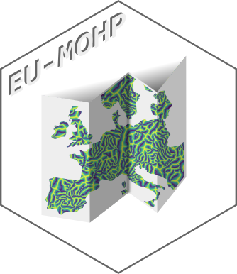

```{r setup, include=FALSE}
knitr::opts_chunk$set(echo = FALSE, fig.align = 'center', fig.pos = "H", out.width = "100%", message = FALSE, warning = FALSE, fig.showtext = TRUE)
library(targets)
library(sf)
library(tmap)
library(tidyverse)
```

<br />
<br />
<br />

<p align="center">
  <a href="https://doi.org/10.4211/hs.0d6999591fb048cab5ab71fcb690eadb">
  
  </a>
</p>

<br />
<br />
<br />

This repository contains the required code to generate the most recent version of the EU-MOHP dataset. For further reading and more background information, we refer to the corresponding publication of the !!datadescriptorlink. The dataset can be freely downloaded at [Hydroshare](https://doi.org/10.4211/hs.0d6999591fb048cab5ab71fcb690eadb).

A static code repository with the version used for generating the dataset can be found on [Hydroshare](https://doi.org/10.4211/hs.8ea376970c904c6698fc8cfe392689de).

The dataset was developed and generated as part of the [](https://www.bgr.bund.de/EN/Themen/Wasser/Projekte/laufend/F+E/Macro/macro_projektbeschr_en.html?nn=1548270) project.

# Spatial Coverage

A figure of the spatial coverage is included in corresponding data descriptor. If you want to check more precisely whether your area of interest is covered by this dataset and which files are relevant, please use this [interactive map](https://mxnl.github.io/macro_mohp_feature/) (it takes a few seconds to load).

[](https://mxnl.github.io/macro_mohp_feature/)

