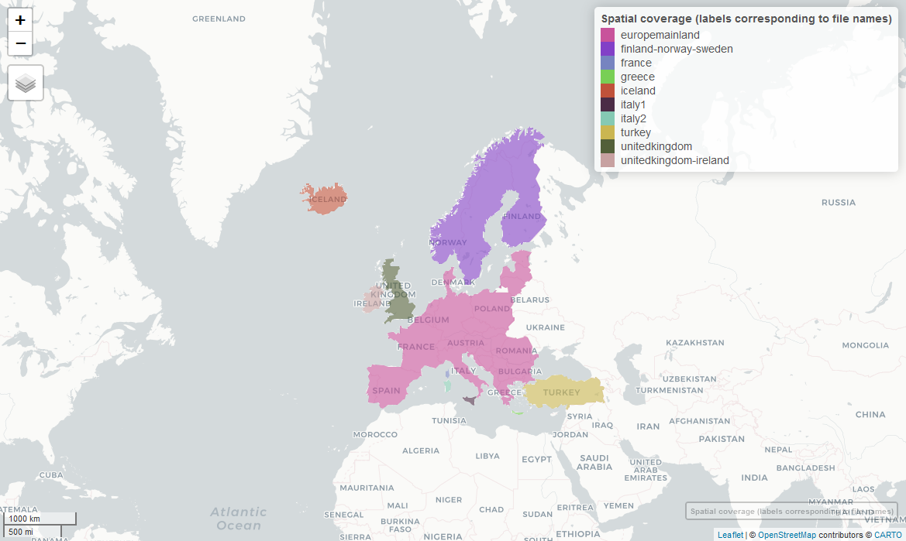

Generation of the EU-MOHP Dataset
================

     

     

This repository contains the required code to generate the EU-MOHP
v013.1.0 dataset. For further reading and more background information,
we refer to the corresponding publication of the !!datadescriptorlink.
The dataset can be freely downloaded at !!link.

A static code repository with the version used for generating the
dataset can be found !!here

The dataset was developed and generated as part of the

project.

# Spatial Coverage

A figure of the spatial coverage is included in corresponding data
descriptor. If you want to check more precisely whether your area of
interest is covered by this dataset and which files are relevant, please
use this [interactive map](https://mxnl.github.io/macro_mohp_feature/).

